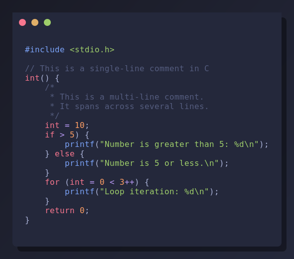
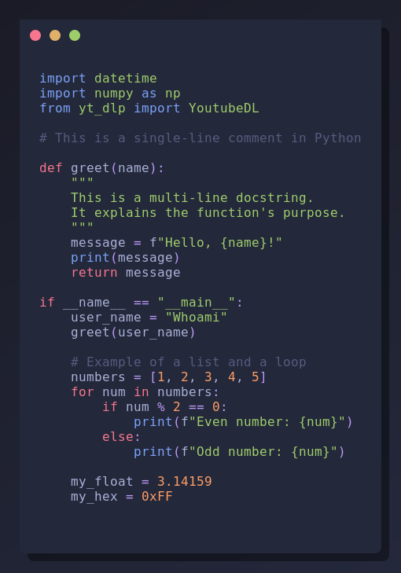

# screenCODE

This is a command-line tool written in C that generates a screenshot of source code files with syntax highlighting. It supports both C and Python syntax highlighting and allows for customization of the window header.

**Important Note:** This is the first version of screenCODE. It may contain bugs, and its current functionality is limited to C and Python syntax highlighting, as these are the primary languages used by me.

## Features

- **Automatic Language Detection**: Automatically detects C or Python files based on their extension (`.c` or `.py`).
- **Syntax Highlighting**: Provides syntax highlighting for C and Python code.
- **Line Numbers**: Option to display line numbers (`-l` flag).
- **Customizable Window Header**: Choose between a gradient or solid color for the window header.
- **Generates PNG Output**: Saves the highlighted code as a PNG image.

## Dependencies

To build this project, you first need to install essential build tools like `gcc`, `make`, and `pkg-config`. After that, you'll need the development libraries for Cairo, Pango, and GLib 2.0.

Here are some examples of how to install these dependencies on various systems:

- **Termux (Android)**:
  ```bash
  pkg install git clang make pkg-config libcairo pango glib
  ```

- **Arch Linux**:
  ```bash
  sudo pacman -S git base-devel pkgconf cairo pango glib2
  ```

- **Debian/Ubuntu**:
  ```bash
  sudo apt install git build-essential pkg-config libcairo2-dev libpango1.0-dev libpangocairo-1.0-0 libglib2.0-dev
  ```

## Build Instructions

To build the project, first clone the repository and then navigate into its directory:

```bash
git clone https://github.com/Hydra0xetc/screenCODE.git
cd screenCODE
make
```

This will compile the source code and create an executable named `screenCODE` in the same directory.

## Usage

```bash
./screenCODE [OPTIONS] <input_file> <output_png>
```

### Options:

- `-lang c|python`: Manually specify the programming language for syntax highlighting. If omitted, the language is auto-detected from the file extension.
- `-no-gradient`: Disable the gradient effect on the window header.
- `-l`: Display line numbers next to the code.

### Arguments:

- `<input_file>`: Path to the source code file to be screenshotted. Currently supports `.c` and `.py` files.
- `<output_png>`: Path where the output PNG image will be saved.

### Examples:

**Screenshot a C file with default gradient:**
```bash
./screenCODE -lang c test_c_code.c c_code_screenshot.png
```


**Screenshot a Python file without gradient:**
```bash
./screenCODE -lang python -no-gradient test_python_code.py python_code_screenshot.png
```


<details>
<summary>How it Works 👇</summary>

The `screenCODE` program is designed to take a source code file (C or Python), apply syntax highlighting, and then generate a PNG image of the highlighted code, resembling a code editor screenshot.

Here's how it works in detail:

1.  **Parsing Command Line Arguments (`main.c`)**:
    *   The program processes the arguments you provide. `input_file` and `output_png` are mandatory.
    *   The `-lang` argument allows manual language specification, overriding auto-detection.
    *   The `-no-gradient` argument disables the header gradient.
    *   The new `-l` argument enables line numbers.

2.  **Language Detection and Validation (`main.c`)**:
    *   If `-lang` is not used, the program attempts to determine the language (C or Python) from the input file's extension.
    *   It validates that the detected or specified language is supported. If not, it warns the user and exits.

3.  **Syntax Table Initialization (`main.c`, `syntax_highlighting_c.c`, `syntax_highlighting_python.c`)**:
    *   Syntax highlighting rules (keywords, functions, etc.) are loaded into efficient hash tables. This is now done once at the start of `main.c` based on the detected language, improving performance and preventing memory leaks.

4.  **Reading Code File Content (`main.c`)**:
    *   The entire content of the source code file is read into memory.

5.  **Syntax Highlighting and Line Numbering (`syntax_highlighting.c`, `syntax_highlighting_c.c`, `syntax_highlighting_python.c`)**:
    *   The `highlight_syntax` function dispatches to language-specific highlighting functions (`highlight_c_syntax` or `highlight_python_syntax`).
    *   These functions now process the code line by line. If line numbers are enabled, they are prepended to each line with proper formatting before syntax highlighting is applied to the entire line.
    *   Tokens (strings, comments, numbers, keywords, operators) are identified, escaped for Pango markup, and wrapped in `<span>` tags with specific colors.

6.  **Text Measurement and Image Dimensions (`main.c`)**:
    *   Pango is used to calculate the exact dimensions of the highlighted text, including line numbers if present. This ensures the output image is sized correctly.

7.  **PNG Image Drawing (`main.c`, `drawing_utils.c`)**:
    *   A Cairo surface is created. The program draws the background, a subtle window shadow, the main window frame with rounded corners, and the window header (using the improved `draw_header` function).
    *   Decorative window control buttons are added.
    *   Finally, the Pango-formatted code (with or without line numbers) is drawn onto the surface.

8.  **Image Saving (`main.c`)**:
    *   The final image is saved as a PNG file.

9.  **Memory Cleanup (`main.c`)**:
    *   All allocated memory and resources are properly freed at the end of the program execution.
</details>